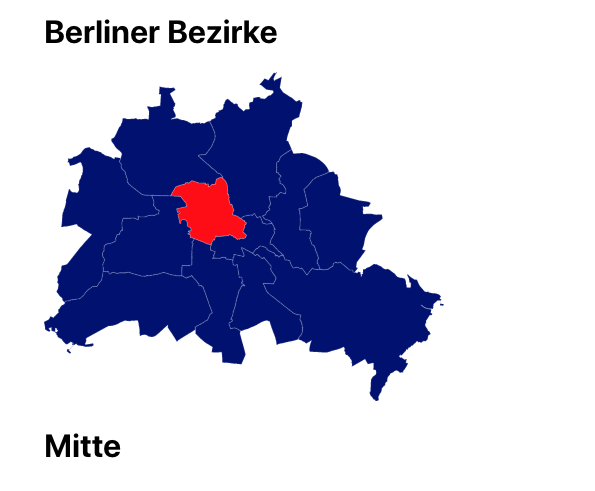

# react-district-map-berlin

An interactive map of the boroughs and districts of Berlin.

## Install

After cloning the repository run:

`yarn`

## Run

In order to start the application enter:

`yarn start`

## Packages

This project was bootstrapped with [Create React App](https://github.com/facebook/create-react-app).

Additionally the [Emotion](https://emotion.sh) library was added.

## License

MIT License
